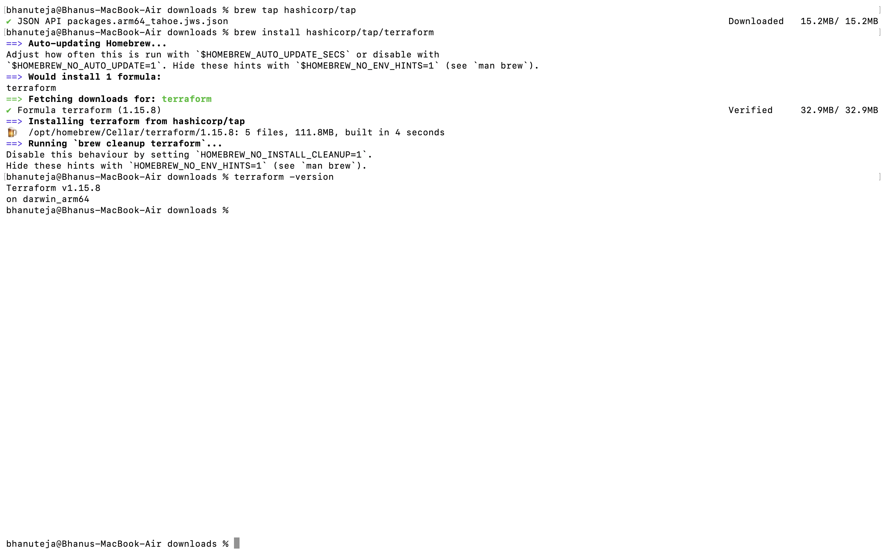
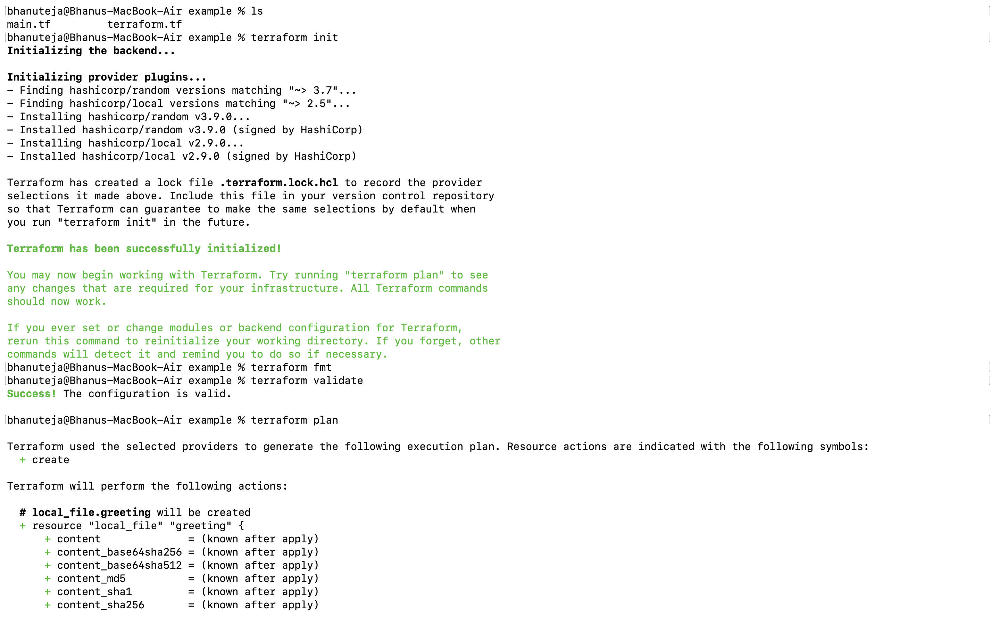
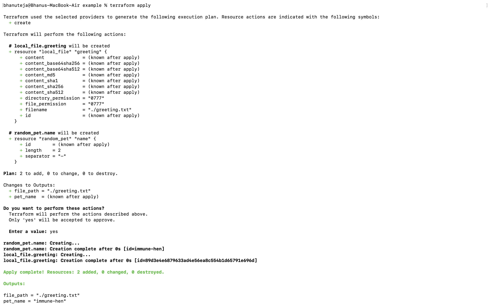
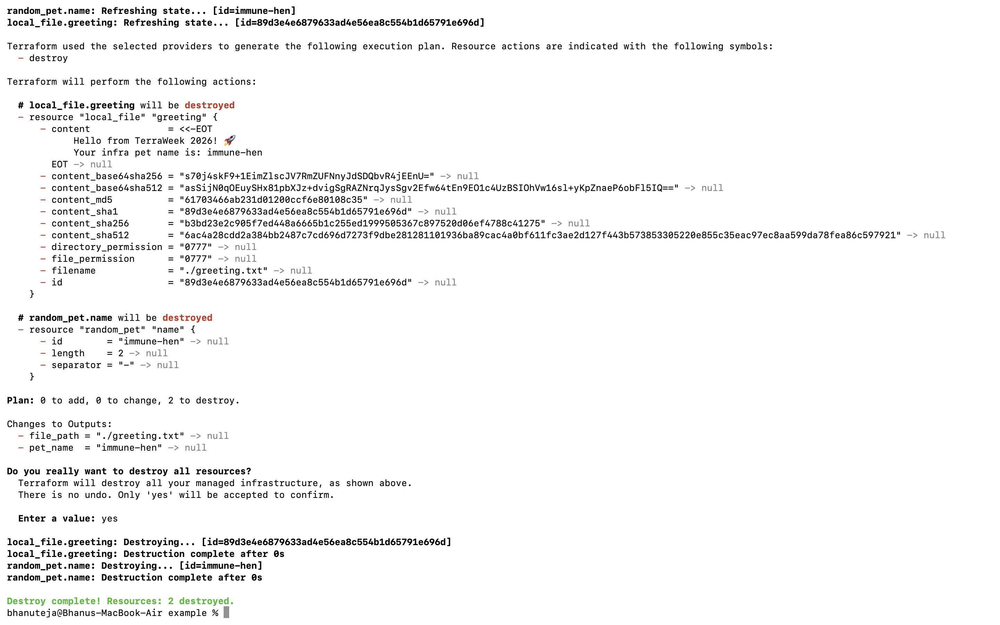
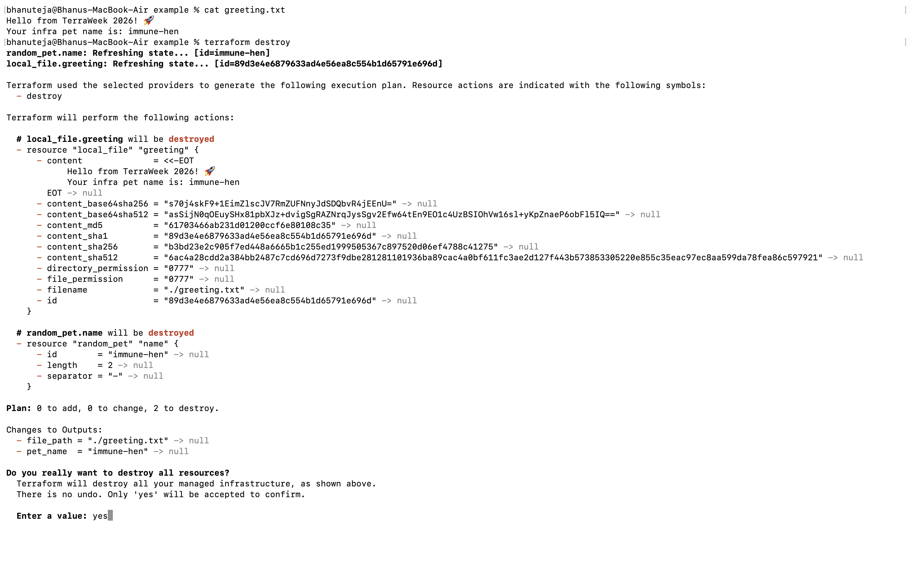

# TerraWeek Challenge – Day 1

---

# Task 1: Understand IaC & Terraform

## What is Infrastructure as Code (IaC)?
Infrastructure as Code (IaC) is the practice of managing and provisioning infrastructure through code instead of manually configuring resources using cloud consoles.

### Benefits
- Automation
- Repeatability
- Version Control
- Consistency
- Reduced Human Errors
- Faster Deployments

---

## What is Terraform?
Terraform is an open-source Infrastructure as Code (IaC) tool developed by HashiCorp. It enables users to define and provision infrastructure using a declarative language called HCL (HashiCorp Configuration Language).

### Why Terraform?
- Declarative configuration
- Multi-cloud support
- Provider-agnostic
- Reusable modules
- State management
- Large community and ecosystem

---

## Terraform vs Other Tools

| Tool | Comparison |
|------|------------|
| OpenTofu | Community-driven open-source fork of Terraform. |
| Pulumi | Uses programming languages like Python, TypeScript, and Go instead of HCL. |
| AWS CloudFormation | AWS-only Infrastructure as Code solution. |
| Ansible | Primarily used for configuration management and application deployment rather than infrastructure provisioning. |

---

# Task 2: Install Terraform (Latest Version)

Installed the latest version of Terraform using the official HashiCorp installation guide.

### Verification Commands

```bash
terraform version
terraform -help
```

Also installed:
- HashiCorp Terraform Extension for VS Code

---

# Task 3: Learn 6 Crucial Terraform Terminologies

## Provider
A provider is a plugin that enables Terraform to interact with cloud platforms or services.

**Example**
```hcl
provider "aws" {
  region = "us-east-1"
}
```

## Resource
A resource represents an infrastructure object that Terraform manages.

**Example**
```hcl
resource "aws_s3_bucket" "mybucket" {}
```

## State
Terraform stores infrastructure information in a state file (`terraform.tfstate`) to track managed resources.

## Plan
The execution plan previews the changes Terraform will make before applying them.

```bash
terraform plan
```

## HCL (HashiCorp Configuration Language)
The declarative language used to write Terraform configuration files.

**Example**
```hcl
resource "aws_instance" "web" {}
```

## Module
A reusable collection of Terraform configurations.

**Example**
```hcl
module "network" {
  source = "./network"
}
```

---

# Task 4: Terraform Workflow

### Initialize Terraform

```bash
terraform init
```

### Format Configuration

```bash
terraform fmt
```

### Validate Configuration

```bash
terraform validate
```

### Preview Changes

```bash
terraform plan
```

### Apply Configuration

```bash
terraform apply
```

### Verify Generated File

```bash
cat greeting.txt
```

### Destroy Resources

```bash
terraform destroy
```

---