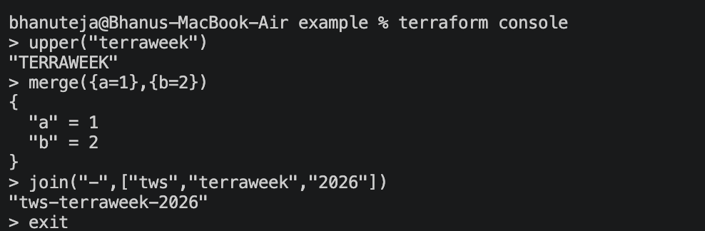
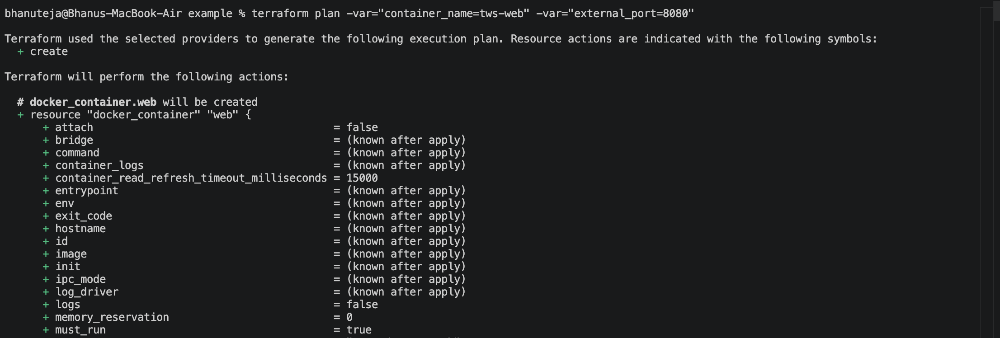
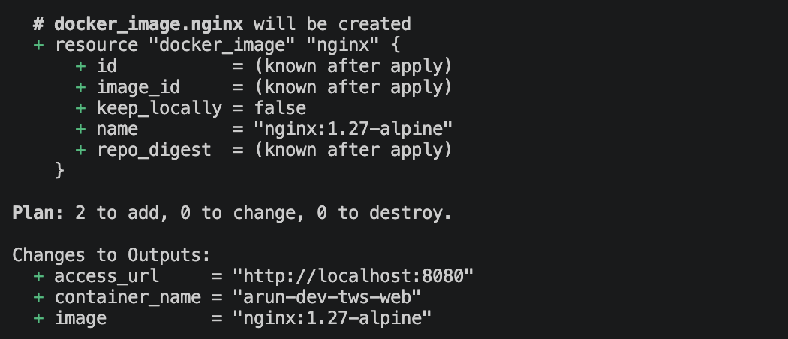
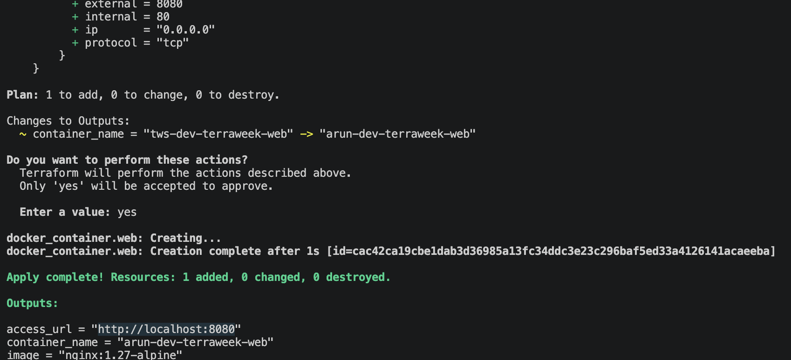
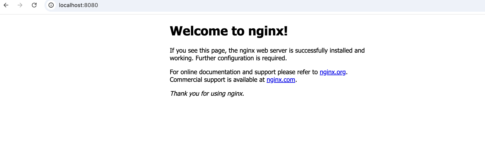
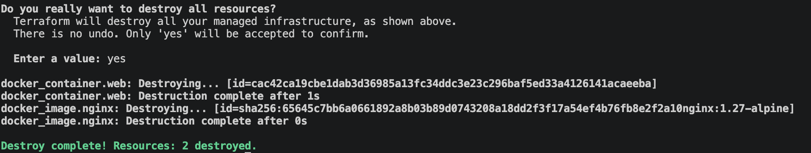

# Terraform Week - HCL, Variables, Locals & Docker
---

# Task 1: Master HCL Syntax

## 1. Anatomy of a Block

Terraform configuration is written using **blocks**.

General syntax:

```hcl
block_type "label_one" "label_two" {
  argument = value
}
```

Example:

```hcl
resource "docker_container" "web" {
  name = "tws-web"
}
```

Explanation:

- **resource** → Block type
- **docker_container** → First label
- **web** → Second label
- **name = "tws-web"** → Argument

---

## 2. Difference Between an Argument and a Block

### Argument

An argument assigns a value to a setting.

Example:

```hcl
name = "tws-web"
```

### Block

A block groups multiple related configuration settings.

Example:

```hcl
ports {
  internal = 80
  external = 8080
}
```

---

## 3. Expressions

Terraform uses expressions to calculate values.

### String Interpolation

```hcl
"${var.environment}-web"
```

### Resource Reference

```hcl
docker_image.nginx.image_id
```

### Operators

```hcl
var.external_port > 1024
```

---

# Task 2: Variables, Types & Validation

This project demonstrates different Terraform variable types.

## Primitive Types

### String

```hcl
variable "container_name" {
  type = string
}
```

### Number

```hcl
variable "external_port" {
  type = number
}
```

### Boolean

```hcl
variable "enable_logging" {
  type    = bool
  default = true
}
```

---

## Collection Types

### List

```hcl
variable "allowed_ports" {
  type = list(string)
}
```

### Map

```hcl
variable "extra_labels" {
  type = map(string)
}
```

### Set

```hcl
variable "server_names" {
  type = set(string)
}
```

---

## Structural Types

### Object

```hcl
variable "app_config" {
  type = object({
    app_name = string
    version  = string
  })
}
```

### Tuple

```hcl
variable "server_details" {
  type = tuple([
    string,
    number,
    bool
  ])
}
```

---

## Variable Validation

Example:

```hcl
variable "environment" {
  type    = string
  default = "dev"

  validation {
    condition     = contains(["dev", "staging", "prod"], var.environment)
    error_message = "environment must be one of: dev, staging, prod."
  }
}
```

---

## Sensitive Variable

```hcl
variable "db_password" {
  type      = string
  sensitive = true
}
```

Sensitive variables prevent Terraform from displaying their values in normal output.

---

# Task 3: Locals, Outputs & Functions

## Locals

Locals allow values to be computed once and reused throughout the project.

Example:

```hcl
locals {
  name_prefix = "tws-${var.environment}"
}
```

---

## Outputs

Outputs display useful information after deployment.

Example:

```hcl
output "container_name" {
  value = docker_container.web.name
}
```

---

## Built-in Functions Used

### merge()

Combines multiple maps.

```hcl
merge({a=1}, {b=2})
```

Result:

```
{
  a = 1
  b = 2
}
```

---

### format()

Formats a string.

```hcl
format("http://localhost:%d", var.external_port)
```

Result:

```
http://localhost:8080
```

---

### upper()

Converts text to uppercase.

```hcl
upper("terraweek")
```

Result:

```
TERRAWEEK
```

---

### length()

Returns the number of elements.

```hcl
length(local.common_labels)
```

---

### join()

Joins list elements.

```hcl
join("-", ["tws", "terraweek", "2026"])
```

Result:

```
tws-terraweek-2026
```

---

# Terraform Console

Commands used:

```bash
terraform console
```


---

# Task 4: Docker Deployment

## Initialize Terraform

```bash
terraform init
```

---

## Plan

Using command-line variables:

```bash
terraform plan \
-var="container_name=tws-web" \
-var="external_port=8080"
```

---

## Apply

```bash
terraform apply \
-var="container_name=tws-web" \
-var="external_port=8080"
```

---

## View Outputs

```bash
terraform output
```


---

## Open Application

Visit:

```
http://localhost:8080
```

You should see the **Nginx Welcome Page**.


---

## Destroy Resources

```bash
terraform destroy \
-var="container_name=tws-web" \
-var="external_port=8080"
```

---

# Using terraform.tfvars

Instead of passing variables every time:

```bash
terraform apply
```

Terraform automatically loads:

```
terraform.tfvars
```

No `-var` arguments are required.

---

# Variable Precedence

Terraform resolves variables in the following order (highest priority first):

1. `-var`
2. `-var-file`
3. `*.auto.tfvars`
4. `terraform.tfvars`
5. `TF_VAR_` environment variables
6. Default values in `variables.tf`

