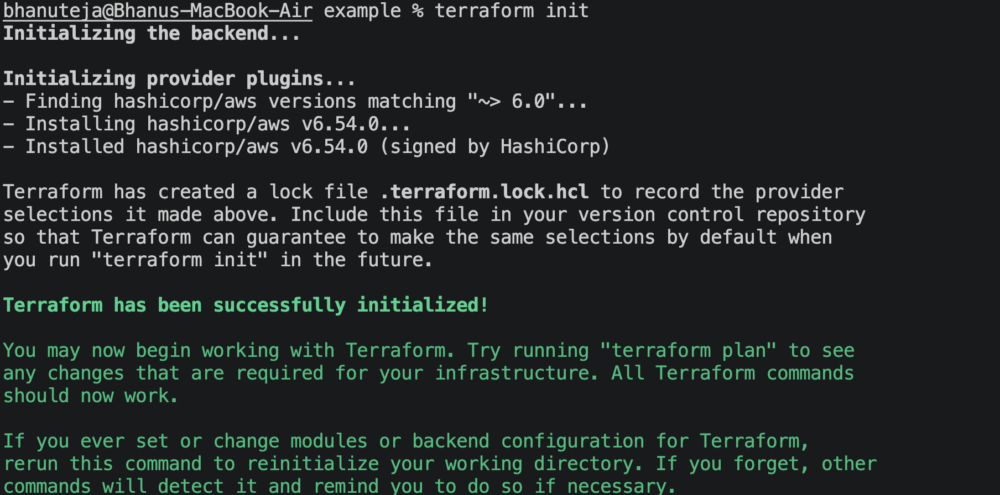
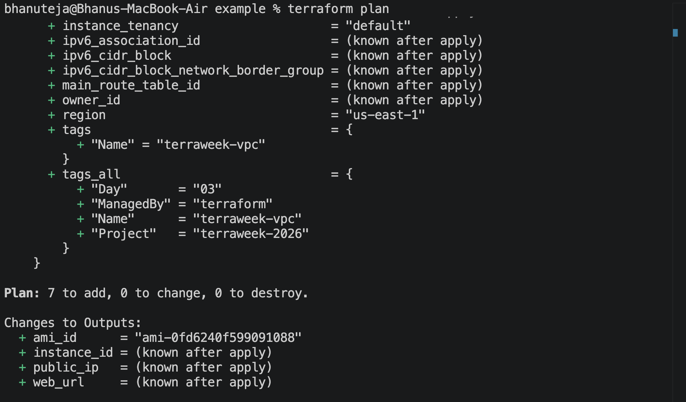
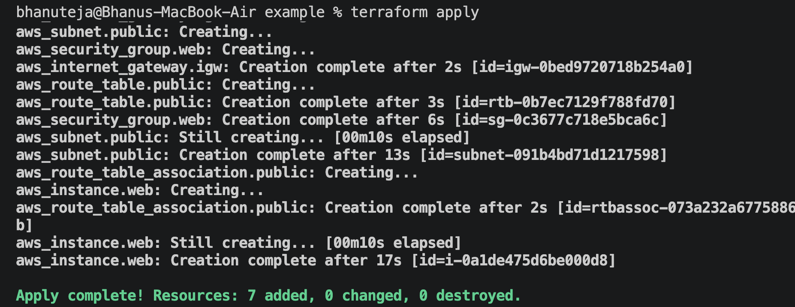
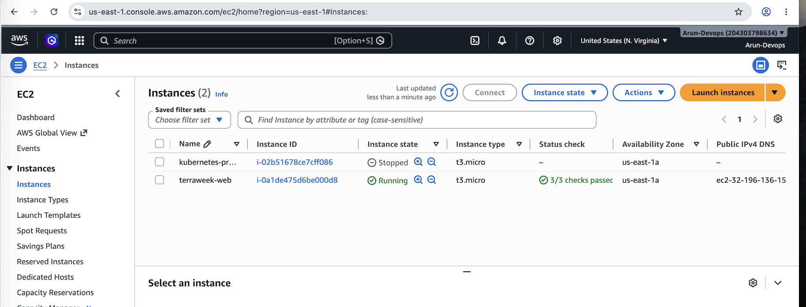
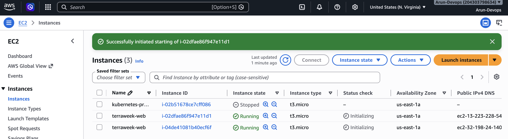
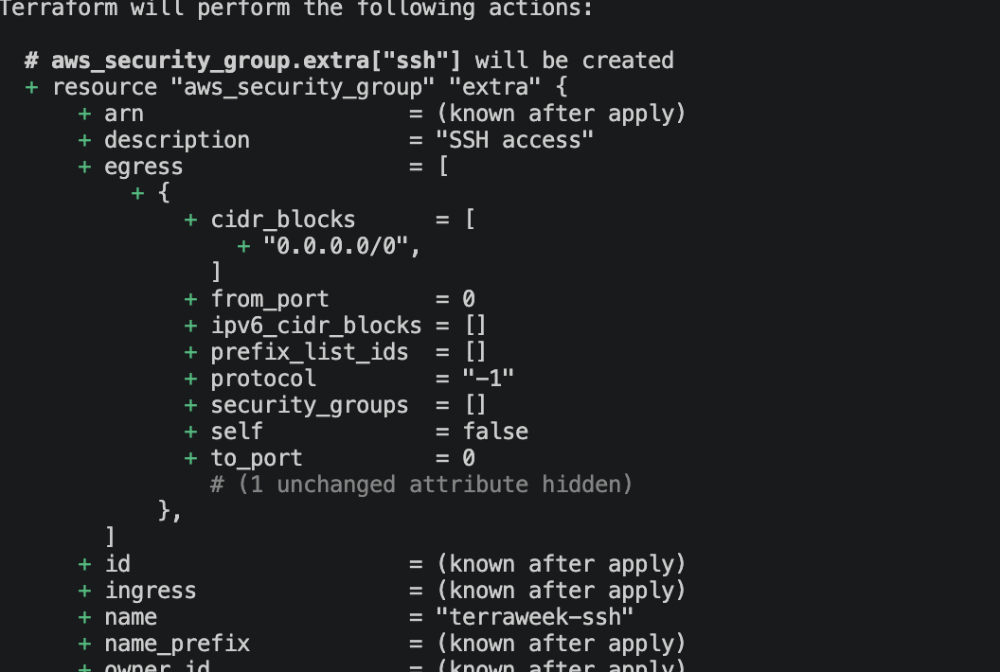
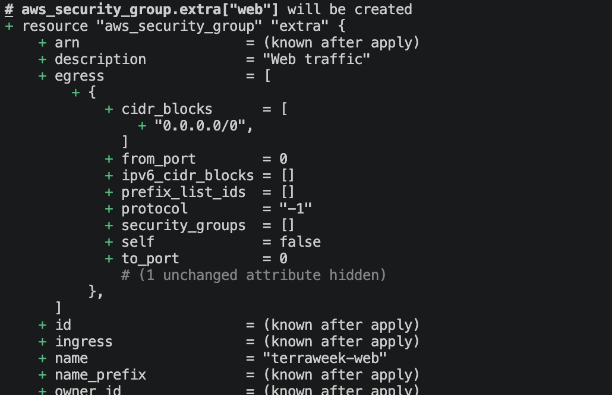
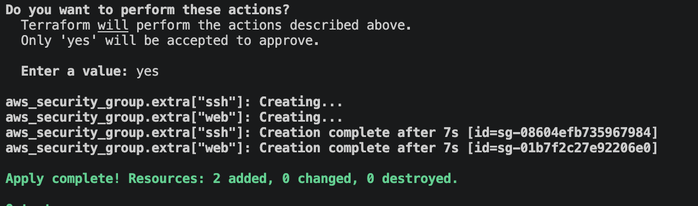
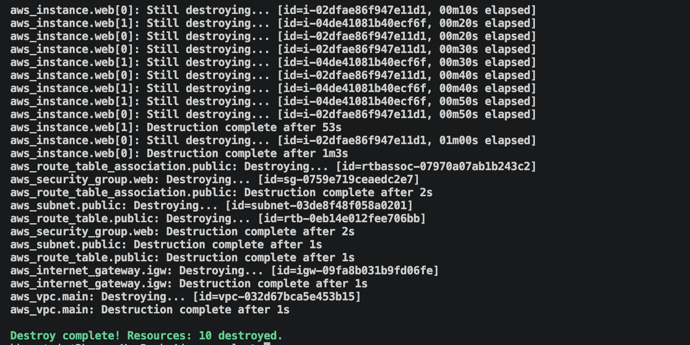
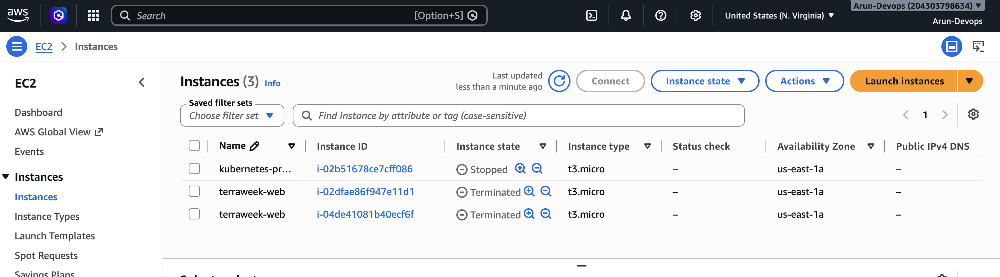

# Day 3 Notes – Providers, Resources & Meta Arguments

## Task 1: Providers & Version Pinning

### `required_version`

```hcl
required_version = ">= 1.10"
```

This tells Terraform to use **version 1.10 or higher**.

### `required_providers`

```hcl
required_providers {
  aws = {
    source  = "hashicorp/aws"
    version = "~> 6.0"
  }
}
```

This tells Terraform which provider to download.

### What does `~>` mean?

`~>` is called **version pinning** (or the pessimistic version constraint).

If you use:

```hcl
version = "~> 6.0"
```

Terraform can install:

* 6.0
* 6.1
* 6.2
* 6.8

But **not 7.0**, because a new major version may have breaking changes.

### Provider Alias

```hcl
provider "aws" {
  alias  = "west"
  region = "us-west-2"
}
```

A provider alias lets you use the same provider in multiple AWS regions. For example, one provider can deploy resources in `us-east-1` and another in `us-west-2`.

---

## Task 2: Resources vs Data Sources

### Resources

```hcl
resource "aws_vpc" "main"

resource "aws_instance" "web"
```

Resources **create and manage infrastructure**.

Examples:

* `aws_vpc` creates a VPC.
* `aws_instance` creates an EC2 instance.

### Data Sources

```hcl
data "aws_ami" "al2023"

data "aws_availability_zones" "available"
```

Data sources **read existing information** from AWS.

Examples:

* `aws_ami` finds the latest Amazon Linux 2023 AMI.
* `aws_availability_zones` gets the available Availability Zones.

### Difference

| Resources                   | Data Sources                     |
| --------------------------- | -------------------------------- |
| Create new infrastructure   | Read existing information        |
| Managed by Terraform        | Read-only                        |
| Can be updated or destroyed | Cannot create or modify anything |

**In short:**

* **Resources = Create and manage infrastructure.**
* **Data Sources = Read existing information.**


## Task 3: Provision the Cloud Stack
terraform init -- downloads providers.

terraform validate -- checks configuration syntax.
terraform plan -- shows the proposed changes.

terraform apply -- creates the infrastructure.


terraform state list -- displays the resources managed by Terraform.


## Task 4: Meta-Arguments in Action

### count

Used `count = 2` to launch two EC2 instances with identical configurations.

**Screenshot**



---

### for_each

Created multiple security groups using a map and `for_each`.

```hcl
for_each = local.security_groups
```

Unlike `count`, every resource has a stable key (`web`, `ssh`) instead of an index.

**Screenshot**





---

### depends_on

Explicitly made the EC2 instance wait for the Internet Gateway and Route Table Association before launching.

```hcl
depends_on = [
  aws_internet_gateway.igw,
  aws_route_table_association.public
]
```

**Screenshot**


---

### lifecycle

Implemented several lifecycle rules:

- `create_before_destroy`
- `ignore_changes`
- `prevent_destroy`

```hcl
lifecycle {
  create_before_destroy = true

  ignore_changes = [
    tags["LastModified"]
  ]
}
```

`prevent_destroy` was tested on the VPC to verify Terraform blocks accidental deletion.

**Screenshots**





