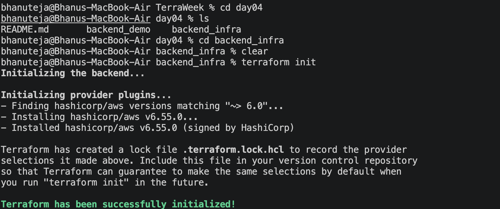
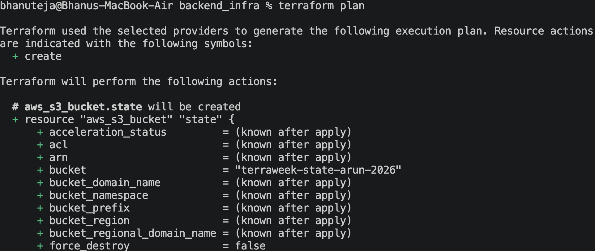
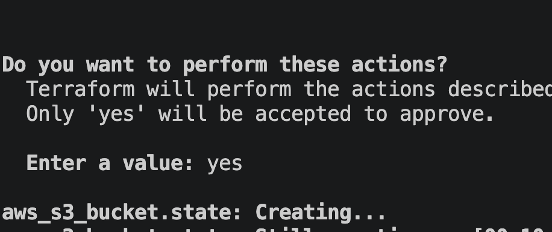
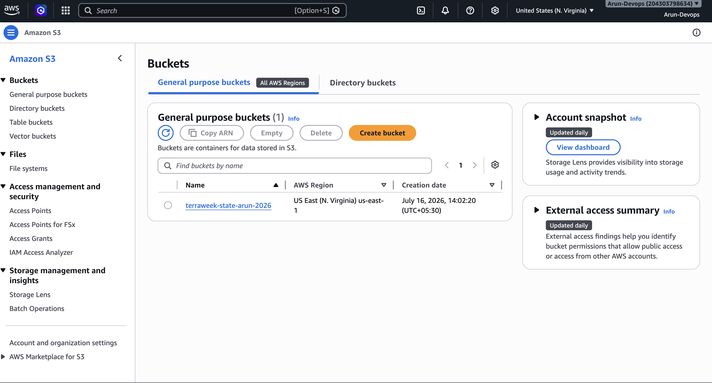
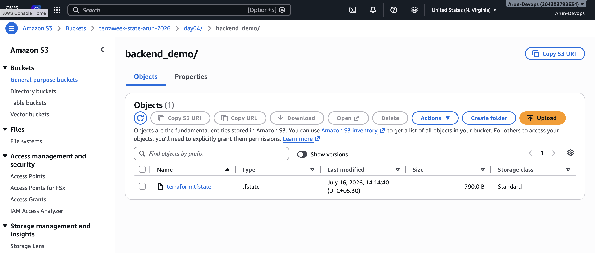

# TerraWeek Day 4 – Terraform State & Remote Backends (Native Locking)

## Objective

Learn how Terraform state works, why it is important, how to use state commands, and how to configure a remote backend using an Amazon S3 bucket with native state locking (`use_lockfile = true`).

---

# Task 1 – Understanding Terraform State

## What is the `terraform.tfstate` file?

The `terraform.tfstate` file is Terraform's state file. It stores the current state of all infrastructure resources managed by Terraform.

It contains information such as:

- Resource IDs
- Resource attributes
- Dependencies
- Outputs
- Metadata
- Current infrastructure state

Terraform compares this file with the configuration files (`.tf`) to determine what changes need to be made.

---

## Why should you never edit the state file manually?

The state file is critical for Terraform operations.

Editing it manually can:

- Corrupt the state
- Cause Terraform to lose track of resources
- Lead to duplicate resource creation
- Accidentally destroy infrastructure

Always use Terraform commands to modify the state.

---

## Why should you never commit it to Git?

The state file may contain sensitive information, including:

- Passwords
- Database endpoints
- IAM resource information
- Private IP addresses
- Access keys
- Secrets stored in resource attributes

For security reasons:

- Store state remotely.
- Encrypt the state.
- Exclude `.tfstate` files using `.gitignore`.

---

## What is State Drift?

State drift occurs when infrastructure changes outside Terraform.

Example:

- Terraform creates an S3 bucket.
- Someone deletes or modifies the bucket using the AWS Console.
- Terraform's state no longer matches the real infrastructure.

Running:

```bash
terraform plan
```

detects these differences.

---

## What is `terraform refresh`?

Older Terraform versions used:

```bash
terraform refresh
```

to update the local state with the current infrastructure.

Modern Terraform automatically refreshes state during:

- `terraform plan`
- `terraform apply`

---

## Why is Terraform State Sensitive?

Terraform state may contain secrets in plaintext.

Examples include:

- Passwords
- API keys
- Database connection strings
- Infrastructure metadata

Therefore, the state should always be:

- Stored remotely
- Encrypted
- Access-controlled
- Versioned

---

# Task 2 – Terraform State Commands

## terraform state list

```bash
terraform state list
```

### Purpose

Lists all resources currently managed by Terraform.

### Use Case

Useful for identifying the resource addresses stored in the state.

---

## terraform state show

```bash
terraform state show random_pet.demo
```

### Purpose

Displays detailed information about a specific resource stored in the state.

### Use Case

Helpful for inspecting resource attributes without logging into AWS.

---

## terraform state mv

```bash
terraform state mv random_pet.demo random_pet.example
```

### Purpose

Moves or renames a resource inside Terraform state without recreating the infrastructure.

### Use Case

Useful during refactoring or resource renaming.

---

## terraform state rm

```bash
terraform state rm random_pet.demo
```

### Purpose

Removes a resource from Terraform state.

### Important

This **does not delete** the actual infrastructure.

Terraform simply stops managing that resource.

---

## terraform show

```bash
terraform show
```

### Purpose

Displays the current Terraform state in a human-readable format.

### Use Case

Useful for reviewing managed resources and outputs.

---

# Task 3 – Bootstrap Backend Infrastructure

A separate Terraform configuration (`backend_infra`) was used to create the S3 bucket that stores the remote Terraform state.

The following resources were created:

- Amazon S3 Bucket
- Bucket Versioning
- Server-side Encryption (AES256)
- Public Access Block

This bootstrap configuration intentionally uses **local state**, because the remote backend does not yet exist.

---

# Task 4 – Configure Remote Backend

The Terraform backend was configured to use Amazon S3.

Configuration:

```hcl
backend "s3" {
  bucket       = "<your-bucket-name>"
  key          = "day04/backend_demo/terraform.tfstate"
  region       = "us-east-1"
  encrypt      = true
  use_lockfile = true
}
```

### Native State Locking

Terraform 1.11 introduces native S3 state locking using:

```hcl
use_lockfile = true
```

Benefits:

- No DynamoDB table required
- Prevents multiple users from modifying state simultaneously
- Uses temporary `.tflock` files inside the S3 bucket

---

# Screenshots

## Screenshot 1

**File Name**



**Description**

Terraform successfully created the backend infrastructure.

---

## Screenshot 2

**File Name**



**Description**

AWS Console showing the S3 backend bucket with Versioning enabled.

---

## Screenshot 3

**File Name**



**Description**

Successful `terraform init` with the S3 backend configuration.

---

## Screenshot 4

**File Name**



**Description**

Successful `terraform apply` in `backend_demo` creating the `random_pet.demo` resource.

---

## Screenshot 5

**File Name**



**Description**

S3 bucket containing:

```
day04/
└── backend_demo/
    └── terraform.tfstate
```

---

## Screenshot 6

**File Name**

`Screenshot_06_S3_Native_Locking.png`

**Description**

Temporary `.tflock` file visible during `terraform apply`.

---

## Screenshot 7

**File Name**

![]Screenshot_07_Terraform_State_Commands.png`

**Description**

Single screenshot showing the outputs of:

```bash
terraform state list

terraform state show random_pet.demo

terraform show
```