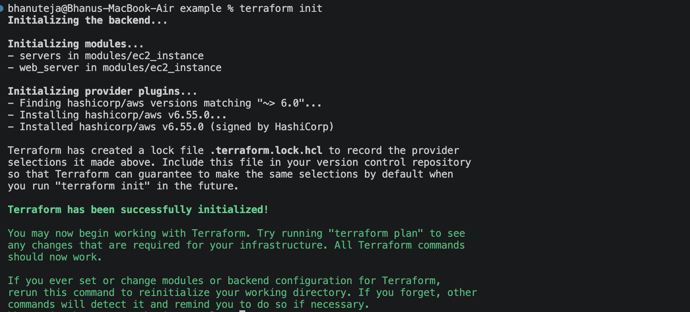
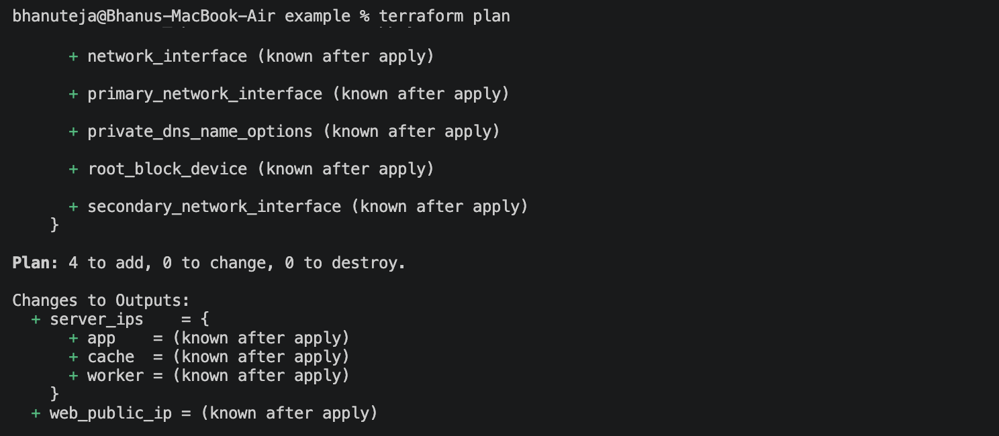
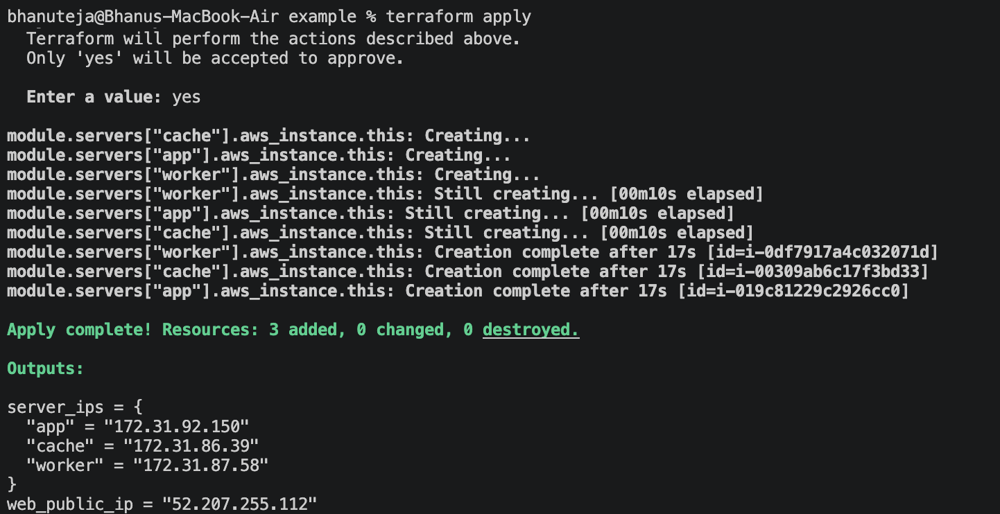
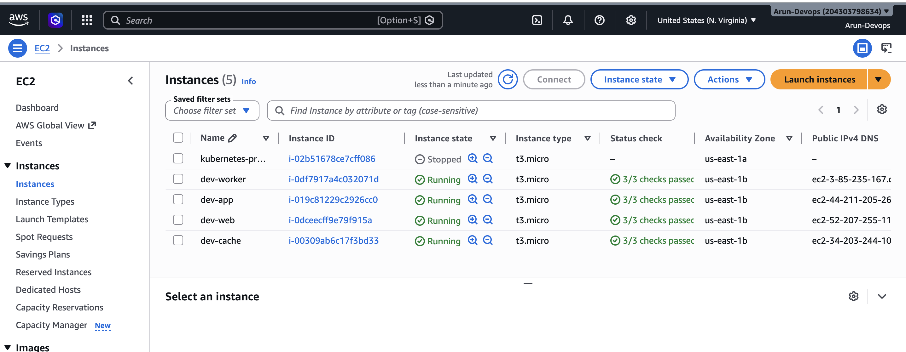
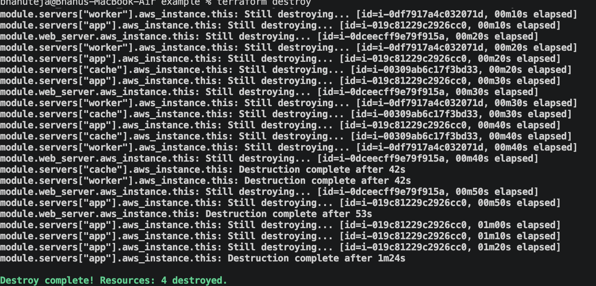
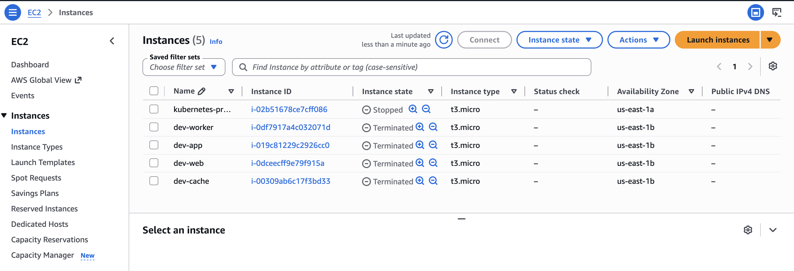
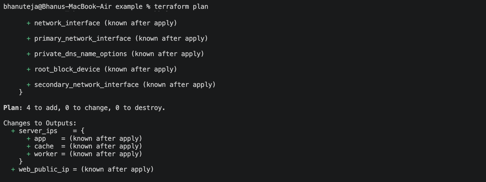
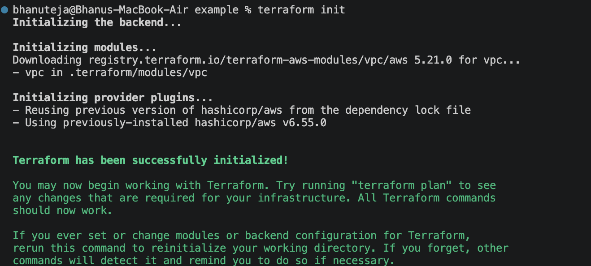
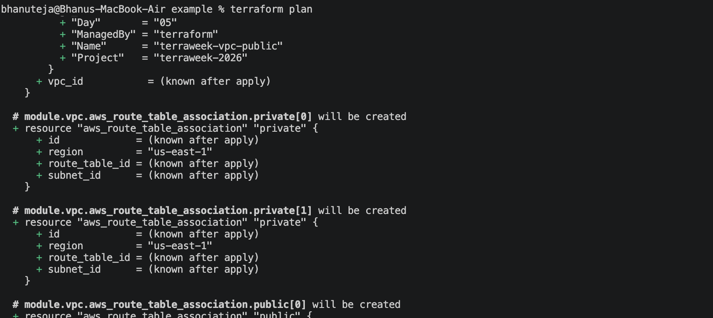

# TerraWeek Day 5 – Modules: Reusable, Composable Infrastructure

**Date:** 16 July 2026

## Objective

Learn how Terraform modules improve code reusability, maintainability, and scalability by creating reusable infrastructure components.

---

# Task 1: Modules – The Why

## What is a Module?

A Terraform module is a reusable collection of Terraform configuration files that work together to create infrastructure resources. Modules help organize code and avoid duplication.

The **Root Module** is the directory where Terraform commands (`terraform init`, `terraform plan`, `terraform apply`) are executed. Any module called from the root module is called a **Child Module**.

### Root Module

- Entry point of the Terraform configuration.
- Calls one or more child modules.
- Resolves shared resources and passes them to child modules.

### Child Module

- Reusable Terraform configuration.
- Accepts inputs through variables.
- Returns values using outputs.

---

## Benefits of Modules

- **Reusability** – Write once, use multiple times.
- **Consistency** – Standardized infrastructure across projects.
- **Encapsulation** – Hide implementation details.
- **Versioning** – Control changes using version numbers.
- **Testing** – Modules can be tested independently.
- **Maintainability** – Easier to update infrastructure.

---

## Standard Module Structure

```
modules/
└── ec2_instance/
    ├── main.tf
    ├── variables.tf
    ├── outputs.tf
    └── README.md
```

| File | Purpose |
|------|---------|
| main.tf | Defines resources |
| variables.tf | Input variables |
| outputs.tf | Export values |
| README.md | Documentation |

---

# Task 2: Create and Use a Local Module

## Project Structure

```
example/
│
├── main.tf
├── outputs.tf
├── terraform.tf
│
└── modules/
      └── ec2_instance/
            ├── main.tf
            ├── variables.tf
            └── outputs.tf
```

The reusable EC2 module accepts the following inputs:

- AMI ID
- Subnet ID
- Security Group IDs
- Instance Type
- Environment
- Tags

The root module resolves shared resources once using data sources and passes them into the child module.

Example:

```hcl
module "web_server" {
  source                 = "./modules/ec2_instance"
  name                   = "web"
  instance_type          = "t3.micro"
  environment            = "dev"
  ami                    = data.aws_ami.al2023.id
  subnet_id              = local.subnet_id
  vpc_security_group_ids = local.security_group_ids
}
```

### Commands Executed

```bash
terraform init
terraform plan
terraform apply
terraform destroy
```

### Screenshots

- **Screenshot 1:**
  - Terraform initialized successfully.
 
 

- **Screenshot 2:** `terraform-plan.png`
  - Execution plan showing EC2 instances to be created.
   

- **Screenshot 3:** `terraform-apply.png`
  - Apply completed successfully.

   

   


- **Screenshot 4:** `terraform-destroy.png`
  - Resources destroyed successfully.

   

   
---

# Task 3: Modular Composition using for_each

The same EC2 module was instantiated multiple times using `for_each`.

```hcl
module "servers" {
  source   = "./modules/ec2_instance"

  for_each = toset([
    "app",
    "worker",
    "cache"
  ])

  name                   = each.key
  instance_type          = "t3.micro"
  environment            = "dev"
  ami                    = data.aws_ami.al2023.id
  subnet_id              = local.subnet_id
  vpc_security_group_ids = local.security_group_ids
}
```

Terraform creates three EC2 instances:

- app
- worker
- cache

### Benefits

- Avoid duplicate code.
- Easy to scale infrastructure.
- Better maintainability.

### Screenshot

- **Screenshot 5:** `terraform-foreach-plan.png`
  - Plan showing app, worker and cache instances.

  

---

# Task 4: Using a Terraform Registry Module

Terraform Registry provides reusable community and official modules.

Example:

```hcl
module "vpc" {
  source  = "terraform-aws-modules/vpc/aws"
  version = "~> 5.0"

  name = "terraweek-vpc"
  cidr = "10.0.0.0/16"

  azs             = ["us-east-1a", "us-east-1b"]
  public_subnets  = ["10.0.101.0/24", "10.0.102.0/24"]
  private_subnets = ["10.0.1.0/24", "10.0.2.0/24"]

  enable_nat_gateway = false
  enable_vpn_gateway = false
}
```

Terraform downloads the module during initialization.

### Screenshots

- **Screenshot 6:** `registry-module-init.png`
  - Registry module downloaded successfully.
    
    

- **Screenshot 7:** `registry-module-plan.png`
  - Plan showing VPC resources.

  

---

# Task 5: Module Version Locking

## Registry Version

```hcl
module "vpc" {
  source  = "terraform-aws-modules/vpc/aws"
  version = "~> 5.0"
}
```

---

## Exact Version

```hcl
version = "5.1.2"
```

---

## Version Range

```hcl
version = ">= 5.0, < 6.0"
```

---

## Git Tag

```hcl
module "example" {
  source = "git::https://github.com/org/repo.git//modules/ec2?ref=v1.2.0"
}
```

---

## Git Commit SHA

```hcl
module "example" {
  source = "git::https://github.com/org/repo.git//modules/ec2?ref=8f5b6d3d7ab3f8f6e5b3"
}
```

---

## Why Version Pinning Matters

- Ensures reproducible builds.
- Prevents unexpected breaking changes.
- Makes deployments predictable.
- Improves collaboration across teams.
- Simplifies debugging and rollbacks.

---

# Learning Outcomes

After completing this exercise, I learned:

- What Terraform modules are.
- Difference between root and child modules.
- How to create reusable modules.
- How to use module inputs and outputs.
- How to instantiate modules using `for_each`.
- How to consume modules from the Terraform Registry.
- How and why to pin module versions.